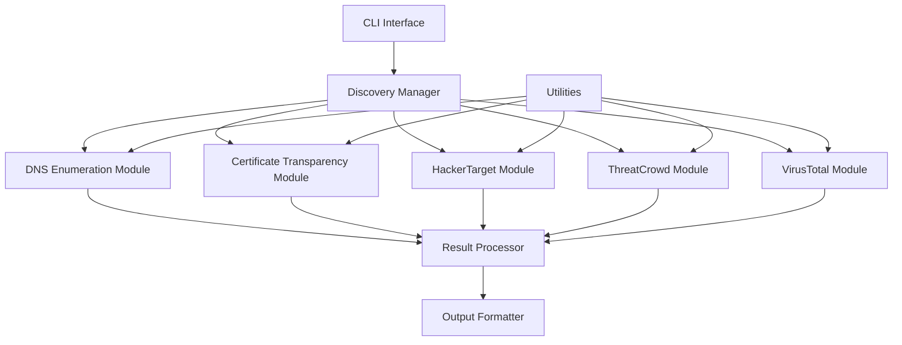

# Design Document: SURIN

## Overview

SURIN (Subdomain Utility for Rapid Identification and Naming) is a command-line tool designed to discover subdomains using multiple advanced methods. The tool leverages DNS enumeration, Certificate Transparency logs, and various threat intelligence APIs to provide comprehensive subdomain reconnaissance capabilities.

This design document outlines the architecture, components, interfaces, data models, error handling, and testing strategy for the SURIN tool.

## Architecture

SURIN follows a modular architecture with clear separation of concerns to ensure maintainability, extensibility, and testability. The architecture consists of the following high-level components:

1. **CLI Interface**: Handles user input, argument parsing, and output formatting
2. **Discovery Manager**: Orchestrates the execution of different discovery methods
3. **Discovery Modules**: Implements specific subdomain discovery techniques
4. **Result Processor**: Aggregates, deduplicates, and formats results
5. **Utilities**: Provides common functionality like DNS resolution, HTTP requests, and error handling

### Architecture Diagram



## Components and Interfaces

### CLI Interface

The CLI interface is responsible for parsing command-line arguments, validating user input, and displaying results. It will be implemented using the `argparse` library for robust argument parsing.

**Key Functions:**
- Parse command-line arguments
- Validate user input
- Display help and usage information
- Format and display results
- Handle output to different formats (text, JSON, CSV)

**Interface:**
```python
class CLI:
    def parse_arguments(self) -> argparse.Namespace:
        """Parse command-line arguments."""
        pass
        
    def validate_input(self, args: argparse.Namespace) -> bool:
        """Validate user input."""
        pass
        
    def display_results(self, results: dict, output_format: str) -> None:
        """Display results in the specified format."""
        pass
        
    def display_summary(self, results: dict) -> None:
        """Display summary of results."""
        pass
```

### Discovery Manager

The Discovery Manager orchestrates the execution of different discovery methods. It manages concurrency, aggregates results, and handles errors from individual modules.

**Key Functions:**
- Initialize discovery modules based on user selection
- Execute discovery methods concurrently
- Aggregate results from different modules
- Handle errors and exceptions

**Interface:**
```python
class DiscoveryManager:
    def __init__(self, domain: str, methods: list, concurrency: int):
        """Initialize the discovery manager."""
        pass
        
    def discover(self) -> dict:
        """Execute selected discovery methods and return results."""
        pass
        
    def _execute_concurrent(self, modules: list) -> list:
        """Execute discovery modules concurrently."""
        pass
```

### Discovery Modules

Each discovery module implements a specific subdomain discovery technique. All modules follow a common interface to ensure consistency and interchangeability.

**Base Interface:**
```python
class DiscoveryModule(ABC):
    def __init__(self, domain: str, **kwargs):
        """Initialize the discovery module."""
        pass
        
    @abstractmethod
    def discover(self) -> list:
        """Execute the discovery method and return subdomains."""
        pass
        
    def validate(self) -> bool:
        """Validate module configuration."""
        pass
```

#### DNS Enumeration Module

Discovers subdomains by attempting to resolve common subdomain patterns.

**Key Functions:**
- Load common subdomain wordlist
- Perform DNS resolution for each potential subdomain
- Handle DNS timeouts and errors
- Return valid subdomains

#### Certificate Transparency Module

Discovers subdomains by querying Certificate Transparency logs via the crt.sh service.

**Key Functions:**
- Query crt.sh API
- Parse and extract subdomains from certificates
- Handle API errors and rate limiting
- Return discovered subdomains

#### Threat Intelligence Modules (HackerTarget, ThreatCrowd, VirusTotal)

Discovers subdomains by querying various threat intelligence APIs.

**Key Functions:**
- Query respective APIs
- Parse API responses
- Handle authentication, rate limiting, and errors
- Return discovered subdomains

### Result Processor

The Result Processor aggregates, deduplicates, and enriches subdomain data.

**Key Functions:**
- Deduplicate subdomains across methods
- Resolve IP addresses for discovered subdomains
- Determine if IPs are public or private
- Check HTTP/HTTPS status codes
- Detect open ports and services
- Generate statistics and summaries

**Interface:**
```python
class ResultProcessor:
    def __init__(self, results: dict):
        """Initialize the result processor."""
        pass
        
    def process(self) -> dict:
        """Process and enrich results."""
        pass
        
    def deduplicate(self) -> dict:
        """Deduplicate subdomains across methods."""
        pass
        
    def enrich(self) -> dict:
        """Enrich subdomain data with additional information."""
        pass
        
    def generate_summary(self) -> dict:
        """Generate summary statistics."""
        pass
```

### Utilities

Utility modules provide common functionality used across the application.

#### DNS Utility

**Key Functions:**
- Resolve domain names to IP addresses
- Check if IP is public or private
- Handle DNS timeouts and errors

#### HTTP Utility

**Key Functions:**
- Make HTTP/HTTPS requests
- Handle timeouts, redirects, and errors
- Get status codes and headers

#### Concurrency Utility

**Key Functions:**
- Manage thread pools
- Implement rate limiting
- Handle concurrent execution

## Data Models

### Subdomain

The core data model representing a discovered subdomain.

```python
class Subdomain:
    def __init__(self, name: str, domain: str):
        self.name = name  # Full subdomain name (e.g., www.example.com)
        self.domain = domain  # Base domain (e.g., example.com)
        self.ip_addresses = []  # List of resolved IP addresses
        self.discovery_methods = []  # Methods that discovered this subdomain
        self.is_public = None  # Boolean indicating if IP is public
        self.http_status = None  # HTTP status code
        self.https_status = None  # HTTPS status code
        self.open_ports = []  # List of open ports
        self.services = {}  # Detected services
```

### Result

The result model representing the complete output of the discovery process.

```python
class Result:
    def __init__(self):
        self.subdomains = {}  # Dictionary of Subdomain objects
        self.stats = {
            'total_subdomains': 0,
            'unique_ips': 0,
            'public_ips': 0,
            'private_ips': 0,
            'network_ranges': [],
            'methods': {}  # Stats per method
        }
```

## Error Handling

SURIN implements a comprehensive error handling strategy to ensure robustness and provide clear feedback to users.

### Error Types

1. **Input Errors**: Invalid domain names, missing required arguments
2. **Network Errors**: Connection timeouts, DNS resolution failures
3. **API Errors**: Authentication failures, rate limiting, service unavailability
4. **System Errors**: Resource limitations, permission issues
5. **Unexpected Errors**: Unhandled exceptions

### Error Handling Strategy

1. **Graceful Degradation**: If one discovery method fails, continue with others
2. **Clear Messaging**: Provide specific error messages with potential solutions
3. **Logging**: Implement different verbosity levels for debugging
4. **Retry Mechanism**: Implement exponential backoff for transient errors
5. **Global Exception Handler**: Catch unhandled exceptions at the top level

```python
class ErrorHandler:
    def __init__(self, verbose: bool = False):
        """Initialize the error handler."""
        self.verbose = verbose
        
    def handle_error(self, error_type: str, message: str, exception: Exception = None) -> None:
        """Handle errors based on type."""
        pass
        
    def log_error(self, message: str, exception: Exception = None) -> None:
        """Log error details."""
        pass
```

## Testing Strategy

SURIN follows a comprehensive testing strategy to ensure reliability and correctness.

### Unit Testing

Unit tests will cover individual components and functions:

1. **CLI Interface**: Test argument parsing, validation, and output formatting
2. **Discovery Modules**: Test each module with mock responses
3. **Result Processor**: Test deduplication, enrichment, and summary generation
4. **Utilities**: Test DNS resolution, HTTP requests, and concurrency

### Integration Testing

Integration tests will verify the interaction between components:

1. **End-to-End Flow**: Test the complete discovery process with a test domain
2. **Error Handling**: Test error scenarios and recovery mechanisms
3. **Concurrency**: Test concurrent execution of discovery methods

### Mock Testing

Mock tests will simulate external dependencies:

1. **API Responses**: Mock responses from crt.sh, HackerTarget, ThreatCrowd, and VirusTotal
2. **DNS Resolution**: Mock DNS responses for controlled testing
3. **HTTP Requests**: Mock HTTP responses for status code checking

### Performance Testing

Performance tests will verify the tool's efficiency:

1. **Concurrency**: Test with different concurrency levels
2. **Large Domains**: Test with domains having many subdomains
3. **Resource Usage**: Monitor CPU, memory, and network usage

## Implementation Considerations

### Programming Language and Dependencies

SURIN will be implemented in Python 3.9+ with the following key dependencies:

1. **argparse**: Command-line argument parsing
2. **requests**: HTTP requests to APIs
3. **dnspython**: DNS resolution and queries
4. **concurrent.futures**: Concurrent execution
5. **tqdm**: Progress indicators
6. **json/csv**: Output formatting

### Performance Optimization

1. **Concurrent Execution**: Use thread pools for I/O-bound operations
2. **Connection Pooling**: Reuse HTTP connections
3. **Caching**: Cache DNS resolutions and API responses
4. **Efficient Data Structures**: Use sets for deduplication
5. **Lazy Loading**: Load resources only when needed

### Security Considerations

1. **API Key Handling**: Secure storage of API keys
2. **Input Validation**: Validate all user input
3. **Rate Limiting**: Respect API rate limits
4. **Error Handling**: Don't expose sensitive information in error messages
5. **Dependency Management**: Keep dependencies updated